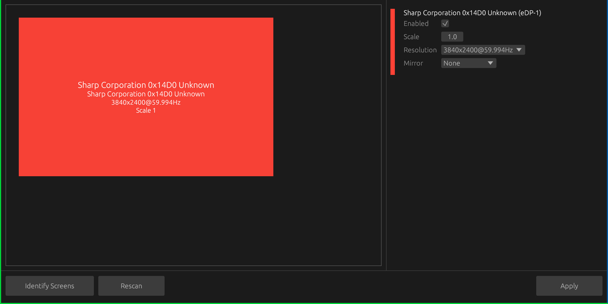

# KanshiUI

KanshiUI is a small desktop GUI for managing display profiles when using the Sway compositor and kanshi. It provides a visual canvas for arranging screens, a sidebar for per-screen settings, and an "Identify Screens" feature that shows one overlay window per connected output with the display name and connector.

## Screenshot



## Features
- Visual canvas showing screen layout
- Sway Support
- Mirroring
- Identify overlays
- Licensed under GPLv3 (see LICENSE)

## Quickstart

Requirements
- Rust + Cargo (for building from source)
- Sway compositor
- kanshi (optional for applying configuration)

## Build

```bash
cargo build --release
# resulting binary: target/release/KanshiUI
```

## Run

Start the GUI (dev):

```bash
cargo run --release
```


